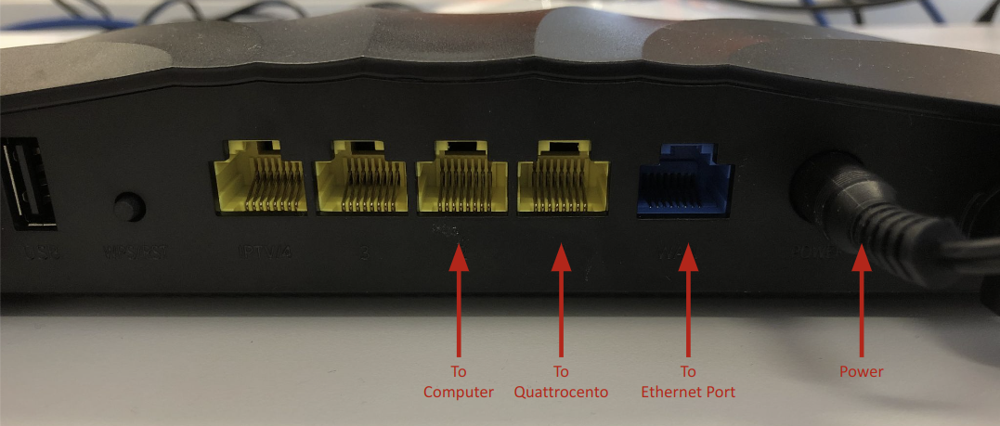

# Real Time Torque Predictions to Control the Technaid H3 Ankle Exoskeleton 

## Set-Up

### -- Hardware --
This package reads data from the OTB Quattrocento and H3 Ankle exoskeleton. To connect these devices, we will use a dedicated router. A Raspberry Pi is used to interface with the exoskeleton controller via a PEAK CAN bus.

<p align="center">


Connect the Quattrocento's ethernet port to a port on the router. The exoskeleton plugs into the control box.
|  |  |
|--|--|
| | |
| ||



</p>

### -- Software --

1. Computer Set-Up
    
    1. Laptop (Ubuntu 22.04 OR Windows 11, ROS Noetic):
        
        *Option 1: Ubuntu 22.04*

        1. Follow this link for installation instructions of ROS Noetic: http://wiki.ros.org/noetic/Installation/Ubuntu
        
        2. Download and Compile Repository
        
            1. Create a directory for your workspace and clone the git repository into the src folder:

                `cd src`

                `git clone https://github.com/Technaid-S-L/technaid_h3_ankle_ros_python`
            
            2. Build the package
                `cd ..`
                `catkin_make`      
        3. Wine Compatibility Layer

            Wine is a tool to run Window-compatible software on the Linux OS. It can be used to access OTB Light and initialize the data stream from the OTB Quattrocento. 

            Install Wine: https://wiki.winehq.org/Ubuntu

            Install OTB using Wine: 
            * https://wiki.winehq.org/Wine_User%27s_Guide
            * https://www.otbioelettronica.it/en/downloads#47-software
                * OTBioLab+ v1.5.7.2  
        
        *Option 2: Windows 11*

        1.  Follow this link for installation instructions of ROS Noetic: http://wiki.ros.org/noetic/Installation/Windows
            * On Step 2, select the noetic-windows branch
        
        2. Download and Compile Repository
        
            1. Create a directory for your workspace and clone the git repository into the src folder:
                ```commandline
                cd src
                git clone https://github.com/Technaid-S-L/technaid_h3_ankle_ros_python`
                ```
            
            2. Build the package
                ```commandline
                cd ..
                catkin_make
                ```
            3. Source the workspace 
                ```commandline
                devel\setup.bat
                ```     
        3. ROS Windows Troubleshooting:
            
            * There is a notorious bug relating to version discrepancies with the tkinter graphics library included in the python distribution specific to ROS Windows. 
            * If an error occurs with this library, try uninstalling and reinstalling:
                ```commandline
                pip uninstall matplotlib
                pip uninstall tk 
                pip install matplotlib
                ```
            
    2. Raspberry Pi (Ubuntu 18.04, ROS Melodic): 
        1. Install Image: *Rpi4B_Ubuntu_18_04.ROS.img* by plugging in the SD card
        2. Run *win32diskimager-1.0.0-install.exe*
        3. In case the SD memory has multiple partitions, apply the following Merge procedure:
            1. Open command and run as administrator
                ```commandline
                diskpart
                list disk
                Select Disk #
                detail disk
                clean
                create partition primary
                active
                format fs=ntfs quick
                ```
        4. In Win32 Disk Imager, select file and the device you are sending to (SD card) and select *"write"*
        5. After installing OS, 
            1. Insert SD card into Raspberry Pi and connect to a monitor with a keyboard and mouse and also power
            2. Login:
                1. User: exoh3
                2. Password: exoskeleton
            3. Check if ROS Melodic is installed
                - Run `roscore` and see if it works

            4. Check if workspace (h3_ws) with H3 package is compiled
            
            5. Open .bashrc in Home
                1. For first trial, comment ROS_MASTER_URI and ROS_IP
            6. Connect battery with main controller through peak can to the Raspberry Pi
                1. Always plug peak can into blue
                2. If peak can is not working see below in *Preparing for every use* step 4 for how to fix this 
            7. Launch h3 hardware interface
                1. Launch hardware interface
                ```buildoutcfg
                    cd h3_ws
                    roslaunch h3_hardware_interface h3_hardware_interface.launch
                    ```
            8. If it launches, we know peak can is working and the H3 can connect

        3. Router Setup
        
            The network configuration with the OTB Quattrocento relies on DHCP

            1. Raspberry Pi: 192.168.0.2
            4. Laptop: User defined
            5. OTB Quattrocento: 192.168.0.6


    
    ## Getting Started with the Package

    The Ubuntu or Windows laptop will serve as the primary computer and ROS Master. Be sure to replace 192.168.0.70 with whatever address is assigned to your computer.

    Access the raspberry pi by connecting to display with HDMI or from the primary computer via ssh:
    ```commandline
    ssh exoh3@192.168.0.2
    password: exoskeleton
    ```

    Terminal 1 (Primary Computer)
    ```commandline
    export ROS_IP=192.168.0.70
    export ROS_MASTER_URI=http://192.168.0.70:11311

    roscore
    ```
    
    Terminal 2 (Raspberry Pi)
    ```commandline
    export ROS_IP=192.168.0.2
    export ROS_MASTER_URI=http://192.168.0.70:11311

    roslaunch h3_hardware_interface h3_hardware_interface.launch
    ```

    Terminal 3 (Raspberry Pi)
    ```commandline
    export ROS_IP=192.168.0.2 # Self
    export ROS_MASTER_URI=http://192.168.0.70:11311

    roslaunch h3_control_client h3_position_controllers.launch
    ```

    Terminal 4 (Primary Computer)
    ```commandline
    export ROS_IP=192.168.0.70
    export ROS_MASTER_URI=http://192.168.0.70:11311

    roslaunch talker_listener h3_launch.launch sim:=True method:=emg
    ```
    


    **h3_launch options**
    * sim (default false)
        * *true*: Stream torque and emg data from pre-defined CSV files. To select different files or change the file path, edit the files in the emg_stream.py and torque_stream.py nodes. 
        * *false*: Run the data stream node to receive values from the Quattrocento, and read torque values from the exoskeleton.
    * method (default emg)
        
        * *emg*: Predict torque from RMS EMG
        * *cst*: Predict torque from nueral drive estimation. Choose the CNN model for motor unit decomposition in the calibrate_cst.py and QC_node_cst.py


    Trouble Shooting:
    
    * Make sure to source each new terminal window in the primary computer (the directory on the raspberry pi should be sourced automatically)
        
        * From the workspace directory:
            
            Windows: ```devel\setup.bat```
            
            Ubuntu:  ```source devel/setup.bash```

    * On windows computers, you may need to disable firewalls

    #### h3_launch.launch options ###


*msg*
- State.msg
- TaskCommand.msg

*srv*
- ControlType.srv
- DataRecording.srv
- Joint.srv
- TriggerOutput.srv
    
### talker_listener - primary package 

*nodes*
- QC_node - receives raw EMG (calls qc_stream) and sends torque command
- QC_MU_predict - (NOT MADE YET) receives EMG and makes MU firing predictions
- QC_Torque_predict - (NOT MADE YET) receives windowed MU firing, ankle angle, etc. and makes torque prediction
- QC_Calibrate - (NOT MADE YET) controls calibration
    
*talker_listener python package*
- Neural Net #1: Individual MU Predictions
    - hdEMG_DCNN.py
    - hdEMG_validate.py
    - qc_communicate.py
    - qc_stream.py
_ listener.py
- talker.py
- test_script.py

### Launch Files used from technaid_h3_ros

- Launches the hardware interface

`h3_hardware_interface h3_hardware_interface.launch`

- Control Client Options:

    1. Position Control: 
        `h3_control_client h3_position_controllers.launch`
    2. Torque Control:
        `h3_control_client h3_torque_controllers.launch`
    3. Task Control:
       `h3_control_client h3_task_controller.launch`
    4. Monitoring: 
       `h3_control_client h3_monitoring_controller.launch`

### Adapting Configuration Variables

- Setting joint control type for each joint - set to no control for unused
    - No control: 0?
    - Position control: 1
    - Torque control: 3
- View Joint Limits
    - ?
- 


## Notes about the H3

- DF is negative, PF is positive, neutral (0 rad) is foot perpendicular to shank
- Angles in radians
- If angle limit is reached, it will stop working until it is pushed back within limits
- Why should I remember 51?
- Difference between joint states and robot states
    - Robot states also includes
    - Order of Joints
        - Robot States: 
        - Joint States: 

## If This Problem Occurs

1. If you are unable to publish but can receive, try turning your firewall off
    1. For example: go to McAffee and turn firewall off

## Next Steps and Considerations

- Create a node for calibration
- Create a node for MU firing prediction
- Strap on the exoskeleton so foot doesn't move
- Receive the ankle exoskeleton adapter
- Condense into a single launch file
- Set protocol for calibration
- Latency testing
- Might want to buy an SD card with more space (64GB, current has 32GB)
- Create my own control_client?
- On the node controlling torque, when I kill the node (ctrl+c), I need it to send torque command of zero
- Figure out PuTTY

## Other Resources

See H3_Documentation_V0.0.2_draft.pdf for H3 Documentation 
