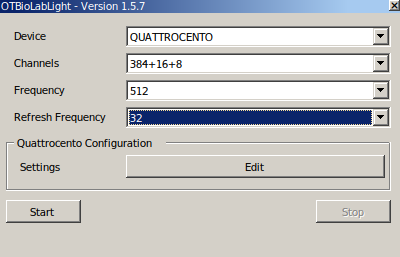

# Real Time Torque Predictions to Control the Technaid H3 Ankle Exoskeleton 

## Overview

This package provides the framework to estimate torque from high-density EMG inputs across 3 muscles. There are two primary methods to train a model for these predictions: root-mean-square EMG signals or muscle activation estimated from a convolutional neural net. The current model is a nonlinear physiologically informed equation considering muscle activity, joint angle, and the interaction between these variables. Future work may consider other models or prediction methods.

## Talker_Listener Package Contents

* calibrate_CST
* calibrate_EMG
    
    * Runs through each of the calibration tasks and then fits a model with the data. The raw data from the torque and emg streams and the final data frame are saved to csv files in the src/talker_listener folder. The model coefficients are published to the parameter server to be used by the QC_node_CST. 

* QC_node_CST
* QC_node_EMG

    * Calculates torque predictions and sends torque_cmd messages to the H3 exoskeletons. 

* qc_stream_node_512
* qc_stream_node_100

    * Reads the Quattrocento high-density emg stream and plubished the data to the /hdEMG topic for the QC_node and calibrate nodes to access.

* torque_stream
* emg_stream

    * Nodes used in simulation mode to mimic the torque and emg streams using pre-recorded raw emg and raw torque csv files. 

## Set-Up

### -- Hardware --
This package reads data from the OTB Quattrocento and H3 Ankle exoskeleton. To connect these devices, we use a dedicated router. A Raspberry Pi provides the interface for the exoskeleton controller via a PEAK CAN bus.

<p align="center">


Connect the Quattrocento's ethernet port to a port on the router. The exoskeleton plugs into the control box.
|  |  |
|--|--|
| | |
| ||


</p>

### -- Software --

1. Computer Set-Up
    
    1. Laptop (Ubuntu 22.04 OR Windows 11, ROS Noetic):
        
        *Option 1: Ubuntu 22.04*

        1. Follow this link for installation instructions of ROS Noetic: http://wiki.ros.org/noetic/Installation/Ubuntu
        
        2. Download and Compile Repository
        
            1. Create a directory for your workspace and clone the git repository into the src folder:

                `cd src`

                `git clone https://github.com/Technaid-S-L/technaid_h3_ankle_ros_python`
            
            2. Build the package
                
                `cd ..`

                `catkin_make`      
        3. Wine Compatibility Layer

            Wine is a tool to run Window-compatible software on the Linux OS. It can be used to access OTB Light and initialize the data stream from the OTB Quattrocento. 

            Install Wine: https://wiki.winehq.org/Ubuntu

            Install OTB using Wine: 
            * https://wiki.winehq.org/Wine_User%27s_Guide
            * https://www.otbioelettronica.it/en/downloads#47-software
                * OTBioLab+ v1.5.7.2  
        
        *Option 2: Windows 11*

        1.  Follow this link for installation instructions of ROS Noetic: http://wiki.ros.org/noetic/Installation/Windows
            * On Step 2, select the noetic-windows branch
        
        2. Download and Compile Repository
        
            1. Create a directory for your workspace and clone the git repository into the src folder:
                ```commandline
                cd src
                git clone https://github.com/Technaid-S-L/technaid_h3_ankle_ros_python`
                ```
            
            2. Build the package
                ```commandline
                cd ..
                catkin_make
                ```
            3. Source the workspace 
                ```commandline
                devel\setup.bat
                ```     
        3. ROS Windows Troubleshooting:
            
            * There is a notorious bug relating to version discrepancies with the tkinter graphics library included in the python distribution specific to ROS Windows. 
            * If an error occurs with this library, try uninstalling and reinstalling:
                ```commandline
                pip uninstall matplotlib
                pip uninstall tk 
                pip install matplotlib
                ```
            
    2. Raspberry Pi (Ubuntu 18.04, ROS Melodic): 
        1. Install Image: *Rpi4B_Ubuntu_18_04.ROS.img* by plugging in the SD card
        2. Run *win32diskimager-1.0.0-install.exe*
        3. In case the SD memory has multiple partitions, apply the following Merge procedure:
            1. Open command and run as administrator
                ```commandline
                diskpart
                list disk
                Select Disk
                detail disk
                clean
                create partition primary
                active
                format fs=ntfs quick
                ```
        4. In Win32 Disk Imager, select file and the device you are sending to (SD card) and select *"write"*
        5. After installing OS, 
            1. Insert SD card into Raspberry Pi and connect to a monitor with a keyboard and mouse and also power
            2. Login:
                1. User: exoh3
                2. Password: exoskeleton
            3. Check if ROS Melodic is installed
                - Run `roscore` and see if it works

            4. Check if workspace (h3_ws) with H3 package is compiled
            
            5. Open .bashrc in Home
                1. For first trial, comment ROS_MASTER_URI and ROS_IP
            6. Connect battery with main controller through peak can to the Raspberry Pi
                1. Always plug peak can into blue
                2. If peak can is not working see below in *Preparing for every use* step 4 for how to fix this 
            7. Launch h3 hardware interface
                1. Launch hardware interface
                ```buildoutcfg
                    cd h3_ws
                    roslaunch h3_hardware_interface h3_hardware_interface.launch
                    ```
            8. If it launches, we know peak can is working and the H3 can connect

    3. Router Setup
        
        The network configuration with the OTB Quattrocento relies on DHCP
        
        1. Raspberry Pi: 192.168.0.2
        4. Laptop: User defined
        5. OTB Quattrocento: 192.168.0.6
    
            [More information on configuring DHCP with the quattrocento](https://otbioelettronica.it/index.php?preview=1&option=com_dropfiles&format=&task=frontfile.download&catid=41&id=106&Itemid=1000000000000)

    ## Streaming EMG Data
    Configure OTB Light and start the data stream before launching if you are not working in simulation.

    <p align="center">
    
    </p>

    The first time you use OTB Light or if you have changed the IP for the Quattrocento since you last used OTB Light, you will need to manually set the IP address by clicking the "Edit" button

    After clicking the "Start" button, you should see a message indicating the data stream has started. At this point you can leave the app to run in the background as long as you do not close the window. If you receive a connection error, ensure you are connected to the router and the IP address in the settings menu of OTB Light matches the IP address displayed on the screen of the Quattrocento. See ["Router Set-Up"](#software).`

    ## Getting Started with the Package

    The Ubuntu or Windows laptop will serve as the primary computer and ROS Master. Be sure to replace 192.168.0.70 with whatever address is assigned to your computer.

    Access the raspberry pi by connecting to a display with HDMI or from the primary computer via ssh:
    ```commandline
    ssh exoh3@192.168.0.2
    password: exoskeleton
    ```


    ### Linux Bash

    - Start a ROS master 

    *Terminal 1 (Primary Computer)*
    ```commandline
    source devel/setup.bash
    export ROS_IP=192.168.0.70
    export ROS_MASTER_URI=http://192.168.0.70:11311

    roscore
    ```
    - Open Raspberry Pi terminals and launch the hardware interface and position controller

    *Terminal 2 (Raspberry Pi)*
    ```commandline
    export ROS_IP=192.168.0.2
    export ROS_MASTER_URI=http://192.168.0.70:11311

    roslaunch h3_hardware_interface h3_hardware_interface.launch
    ```

    *Terminal 3 (Raspberry Pi)*
    ```commandline
    export ROS_IP=192.168.0.2
    export ROS_MASTER_URI=http://192.168.0.70:11311

    roslaunch h3_control_client h3_position_controllers.launch
    ```

    - Begin the calibration procedure 

    *Terminal 4 (Primary Computer)*
    ```commandline
    source devel/setup.bash
    export ROS_IP=192.168.0.70
    export ROS_MASTER_URI=http://192.168.0.70:11311

    roslaunch talker_listener h3_launch.launch sim:=True method:=emg
    ```

    <p align="center">
    
    </p>

    ### Windows

    - Configure environment variables:
    
        * Under System Variables:
            * ROS_MASTER_URI=http://192.168.0.70:11311
            * ROS_IP=192.168.0.70

    - Start a ROS master

    *Terminal 1 (Primary Computer)*
    ```commandline
    roscore
    ```

   - Open Raspberry Pi terminals and launch the hardware interface and position controller

    *Terminal 2 (Raspberry Pi)*
    ```commandline
    export ROS_IP=192.168.0.2
    export ROS_MASTER_URI=http://192.168.0.70:11311

    roslaunch h3_hardware_interface h3_hardware_interface.launch
    ```

    *Terminal 3 (Raspberry Pi)*
    ```commandline
    export ROS_IP=192.168.0.2
    export ROS_MASTER_URI=http://192.168.0.70:11311

    roslaunch h3_control_client h3_position_controllers.launch
    ```

    - Begin the calibration procedure 

    *Terminal 4 (Primary Computer)*
    ```commandline
    devel\setup.bat
    export ROS_IP=192.168.0.70
    export ROS_MASTER_URI=http://192.168.0.70:11311

    roslaunch talker_listener h3_launch.launch sim:=True method:=emg
    ```

    **h3_launch options:**
    * sim (default false)
        * *true*: Stream torque and emg data from pre-defined CSV files. To select different files or change the file path, edit the files in the emg_stream.py and torque_stream.py nodes. 
        * *false*: Run the data stream node to receive values from the Quattrocento, read torque values from the H3's joint torque sensor and send position and torque commands to the H3.
    * method (default emg)
        
        * *emg*: Predict torque from RMS EMG
        * *cst*: Predict torque from nueral drive estimation. Choose the CNN model for motor unit decomposition in the calibrate_cst.py and QC_node_cst.py

    **Trouble Shooting:**
    
    * Make sure to source each new terminal window in the primary computer (the directory on the raspberry pi should be sourced automatically)
        
        * From the workspace directory:
            
            Windows: ```devel\setup.bat```
            
            Ubuntu:  ```source devel/setup.bash```

    * On windows computers, you may need to disable firewalls

## Experiment Set-Up

This package currently support high-density EMG data from 3 64-channel electrode grids. 

<p align="center">

</p>

All experiments have so far used the tibialis anterior, gastrocnemius, and soleus. For the best signal quality, use new, clean electrodes. 

To ground the system, attach 2 wet ankle bands to the rightmost Quattrocento ground ports ("DAL Out" and "DAL In"). Stick two ground electrodes on the tibia, and connect one to the left Quattrocento ground port ("Patient Ref"). Connect the three EMG amplifiers together with the second ground electrode. 

<p align="center">

|  |  |  |
|--|--|--|
| |||

</p>